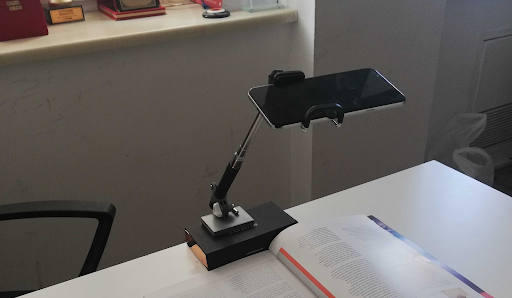

### Introduction

MonReader is a new mobile document digitization experience for the blind, for researchers and for everyone else in need for fully automatic, highly fast and high-quality document scanning in bulk. It is composed of a mobile app and all the user needs to do is flip pages and everything is handled by MonReader: it detects page flips from low-resolution camera preview and takes a high-resolution picture of the document, recognizing its corners and crops it accordingly, and it dewarps the cropped document to obtain a bird's eye view, sharpens the contrast between the text and the background and finally recognizes the text with formatting kept intact, being further corrected by MonReader's ML powered redactor.

### Data Description
Images of the book are labeled in folders as Flip and Not Flip

### Goal
Predict if the page is being flipped using a single image.

### Steps
* Images read from folders in Good drive
* Rename the sub-folders so that they will be sequential a_notflip 0 b_flip 1
* Check the number of images in each folder and display few images
* Using Keras preprocessing image_dataset_from_directory split data into training and validation
* Rescale images to 255, used 2D convolutional (64,128,256) and Maxpoling2D layers. Dropout of 40% after each Convolutional 2D and Maxpooling(2,2) layer combination was used. 1 Dense layer(128 nodes) and 1 output layer with binary output
* Loss function = binary_crossentropy   and Optimizer = Adam 
* Used call function to stop training when accuracy is 97-98
* Calculated F1 score metric for each epoch using Precision/Recall 
* Since I was using image_dataset_from_directory  the data was in batch, so I have to iterate over each batch in the training/test dataset to extract the images and labels
* Build confusion matrix for the training data using images and labels 
* For the testing data , I read all the images in one batch and use the next (iter(testdata)) to get the images and labels and then use the images to make the label prediction with the model
* Build confusion matrix for the test data using images and labels 

### Conclusion
ROC score ~ 0.98 achieved for CNN model
F1 score = 0.98

